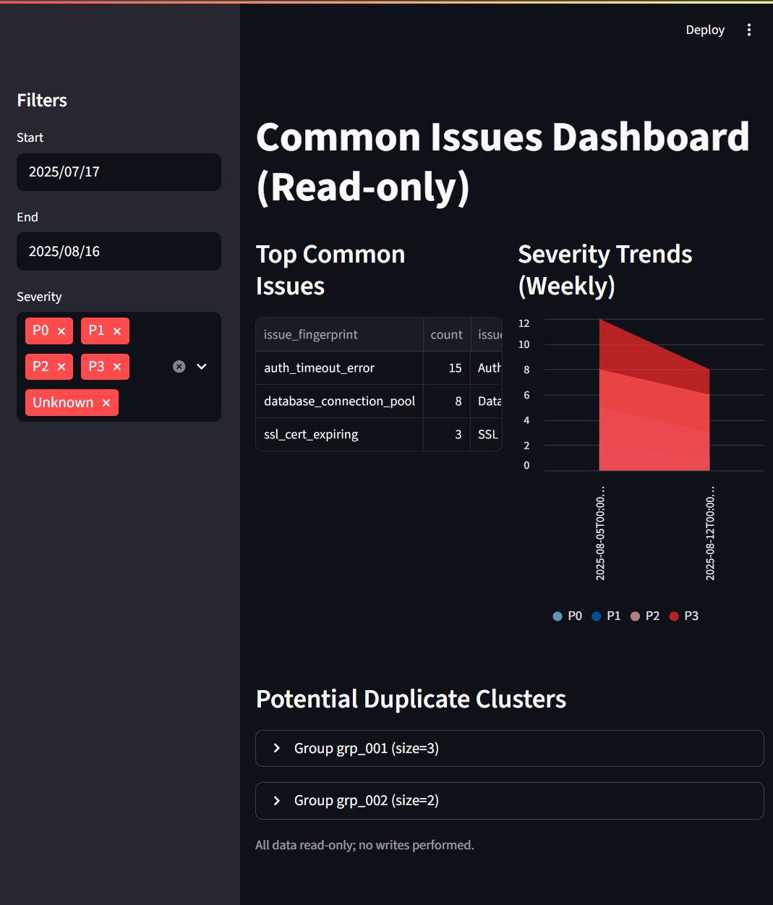

# projectNorthStar

[](https://github.com/rcmiller01/projectNorthStar/actions/workflows/ci.yml)
[](LICENSE)
[](https://www.python.org/)

AI-assisted triage & knowledge retrieval over BigQuery with Vertex AI integration, featuring embeddings, vector search, and a real-time dashboard for issue analysis.

## 🚀 Features

- **BigQuery + Vertex AI Integration**: Remote models for embeddings and text generation
- **Real-time Dashboard**: Streamlit-based analytics dashboard with issue severity tracking
- **Vector Search**: Hybrid retrieval using embeddings and traditional search
- **Issue Triage**: AI-powered automated triage with severity classification
- **Smart Routing**: Intelligent query routing with BigQuery ML model training
- **Graph Expansion**: Enhanced retrieval with neighbor relationships
- **Security First**: Proper credential management and data sanitization

> 📋 **[BigQuery AI Hackathon Experience](docs/survey.md)** - Read about our team's experience building this multimodal AI triage system with BigQuery ML, including challenges, successes, and lessons learned during the hackathon.

## 📋 Prerequisites

- Google Cloud Project with BigQuery and Vertex AI enabled
- Python 3.10+
- Service Account with appropriate permissions:
  - BigQuery Admin
  - Vertex AI User
  - BigQuery Connection Admin

## ⚡ Quick Start

### 1. Environment Setup

Copy the environment template and configure your credentials:

```bash
cp .env.template .env
# Edit .env with your project details and credentials
```

Required environment variables:
```bash
PROJECT_ID=your-project-id
DATASET=demo_ai
LOCATION=US
BIGQUERY_REAL=1
GOOGLE_APPLICATION_CREDENTIALS=/path/to/service-account.json
```

### 2. Installation

Install with all features enabled:
```bash
pip install -e .[bigquery,ingest,dashboard,dev]
```

### 3. BigQuery Setup

Create remote models and views:
```bash
make create-remote-models
make create-views
```

### 4. Data Ingestion

Ingest sample data and generate embeddings:
```bash
python -m core.cli ingest --path samples --type auto --max-tokens 512 --refresh-loop
```

### 5. Launch Dashboard

Start the analytics dashboard:
```bash
streamlit run src/dashboard/app.py
```

Navigate to http://localhost:8501 to view:
- Issue severity distribution
- Common issues breakdown  
- Duplicate content detection
- Interactive filtering and analytics

### 6. AI Triage

Run automated triage analysis:
```bash
python -m core.cli triage --title "500 after reset" --body "android camera" --severity P1 --out out/triage_plan.md
```

**Advanced Routing Options:**
```bash
# Auto mode: learned routing if model exists, else heuristic fallback
python -m core.cli triage --title "PDF export fails" --body "error message" --router auto --out out/plan.md

# Heuristic mode: rule-based routing only
python -m core.cli triage --title "Connection timeout" --body "database error" --router heuristic --out out/plan.md

# Learned mode: BigQuery ML model only (requires training)
python -m core.cli triage --title "Document upload" --body "image processing" --router learned --out out/plan.md
```

**Live BigQuery Example (PowerShell):**
```powershell
$env:BIGQUERY_REAL = "1"
$env:PROJECT_ID = "your-project-id"
$env:DATASET = "demo_ai"
$env:LOCATION = "US"
python -m core.cli triage --title "Image upload fails" --body "content-type mismatch" --out out/plan_live.md
```

### 7. Router Training (Optional)

Train the intelligent routing model for better query classification:
```bash
# Set up environment
export PROJECT_ID=your-project-id DATASET=demo_ai BIGQUERY_REAL=1

# Train BQML logistic regression model
make train-router
# or directly
python -m core.cli train-router
```

### 8. Graph Enhancement (Optional)

Build neighbor relationships for enhanced retrieval quality:
```bash
# Create chunk neighbor table from duplicates and co-links
export PROJECT_ID=your-project-id DATASET=demo_ai
make build-neighbors

# Use with graph expansion
python -m core.cli triage --title "Database error" --graph-boost 0.2
```

## 🔧 Architecture


Core components:
- **Ingest**: OCR/PDF/logs → chunks → embeddings
- **Retrieval**: Hybrid vector + lexical search with filtering
- **Triage**: AI orchestrator with plan generation and verification
- **Dashboard**: Real-time analytics over BigQuery views
- **Tickets**: Optional ticket management with evidence linking

### Triage Sequence


Key mapping:
- Orchestrator logic: `core/orchestrator.py`
- Ticket repo + schema: `bq/tickets.py`, `sql/ddl_tickets.sql`
- Retrieval: `retrieval/hybrid.py`, `sql/chunk_vector_search.sql`
- Embedding & search: BigQuery `ML.GENERATE_EMBEDDING`, `ML.VECTOR_SEARCH`
- Draft: `experts/kb_writer.py`
- Verify: `verify/kb_verifier.py`

### Smart Routing with BigQuery ML

The system includes an intelligent router that adapts retrieval strategy based on query characteristics.

**Routing Strategies:**
- `logs_only`: Types=['log'], k=8 - for error messages, stack traces, timeouts
- `pdf_image`: Types=['pdf','image','image_ocr'], k=6 - for documents, diagrams, manuals
- `mixed`: Types=[], k=10 - for complex queries needing all content types

**Scoring Formula (Graph Enhancement):**
- `final_score = (1 - graph_boost) * vector_score + graph_boost * neighbor_weight`
- Default: 80% vector similarity + 20% graph boost
- Safe fallback to vector-only if neighbor table missing

## 🛡️ Security & Privacy

### Data Protection
- **No Hardcoded Credentials**: All sensitive data uses environment variables
- **Text Sanitization**: Automatic masking of emails, tokens, and API keys
- **Content Truncation**: Dashboard snippets limited to 200 characters
- **Synthetic Samples**: Demo data is non-sensitive and artificially generated

### Credential Management
- **Service Account**: Recommended authentication method
- **Environment Variables**: Sensitive config via `.env` (gitignored)
- **Secure Defaults**: Generic placeholders instead of real project IDs

### Secret Scanning
Automated secret detection in CI:
```bash
make sweep-secrets         # Local secret scan
make sweep-secrets-strict  # Strict mode with lower threshold
```

### Best Practices
1. **Use `.env.template`**: Copy and customize for your environment
2. **Never commit `.env`**: Already in `.gitignore` 
3. **Synthetic Data**: Use non-sensitive test data for demos
4. **Review Changes**: Check for accidentally committed credentials

## 📊 Dashboard Features



The Streamlit dashboard provides real-time analytics:

### Issue Severity Analysis
- Distribution charts showing critical/high/medium/low issues
- Trend analysis with weekly breakdowns
- Severity-based filtering and drill-down

### Common Issues Detection
- Automatic grouping by content similarity
- Occurrence frequency tracking
- Sample content preview with masking

### Duplicate Content Analysis
- Vector-based duplicate detection
- Cluster visualization with member counts
- Content deduplication recommendations

### Interactive Features
- Date range filtering
- Severity level selection
- Real-time BigQuery integration
- Export capabilities for further analysis

**Installation & Setup:**
```bash
pip install -e .[dashboard]
# PowerShell example with live BigQuery
$env:BIGQUERY_REAL = "1"
$env:PROJECT_ID = "your-project-id"
$env:DATASET = "demo_ai"
$env:LOCATION = "US"
make dashboard
```

**Views Created (idempotent):**
- `view_common_issues`: naive fingerprint aggregation (first 8 normalized words)
- `view_issues_by_severity`: weekly counts by normalized severity (P0–P3, Unknown)
- `view_duplicate_chunks`: approximate duplicate clusters via ML.VECTOR_SEARCH

**Safety:** Snippets truncated to 200 chars + basic masking (emails, bearer tokens, AWS access keys). No writes or full meta exposure.

## 🧪 Development

### Local Development Setup
```bash
pip install -e .[dev]
make setup-dev
```

### Code Quality
```bash
make check          # Run all checks
make pre-commit-all # Format and lint
```

### Testing & Evaluation
```bash
make eval           # Run evaluation suite
make demo           # End-to-end demo
```

**Enhanced Evaluation Metrics:**
- `hit_rate`: Fraction of queries with at least one matching expected term
- `mean_min_distance`: Average minimum distance across retrieved results
- `mean_verifier_score`: Average verification score for generated playbooks
- `ndcg@5`: Normalized Discounted Cumulative Gain at rank 5
- `mrr`: Mean Reciprocal Rank of first relevant result

### Release Process
```bash
make release-dry-run part=patch  # Preview changes
make release part=minor          # Create release
```

**Automated workflow:**
1. Clean working tree enforced
2. Determine new version from `part=` (major|minor|patch)
3. Generate grouped changelog from commits since last tag
4. Update `pyproject.toml` + prepend `CHANGELOG.md`
5. Commit `chore(release): vX.Y.Z` and create git tag `vX.Y.Z`

### Security Scanning
```bash
make sweep-secrets         # Local secret scan
make sweep-secrets-strict  # Strict mode with lower threshold
make public-sweep         # Large files, notebook outputs, internal URLs
```

Pre-commit hooks: `secret-sweep` (medium threshold) and `nbstripout` (removes notebook outputs on commit).

## 📁 Project Structure

```
├── src/                  # Main source code
│   ├── dashboard/        # Streamlit dashboard
│   └── bq/              # BigQuery integration
├── core/                # CLI and orchestrator
├── experts/             # Knowledge base writer
├── retrieval/           # Hybrid search implementation
├── pipeline/            # Classification pipeline
├── ingest/              # Data ingestion (OCR, chunking)
├── verify/              # Verification logic
├── scripts/             # Utility scripts
├── sql/                 # SQL queries and schemas
├── samples/             # Demo data (synthetic)
├── docs/                # Documentation and diagrams
├── tests/               # Test suite
├── metrics/             # Evaluation results
└── .env.template        # Environment template
```

## 🚀 Quick Demo (End-to-End)

Requires live BigQuery (`BIGQUERY_REAL=1`) and existing remote models:

```bash
export PROJECT_ID=your-project-id
export DATASET=demo_ai
export LOCATION=US
export BIGQUERY_REAL=1
pip install -e .[bigquery,ingest,dashboard,dev]
make demo
```

**Output artifacts:**
- `out/demo_freeform.md` - Freeform triage playbook
- `out/demo_ticket.md` - Ticket triage playbook (DEMO-1)

**Summary line example:**
```
[demo-summary] ticket_links=5 resolutions=1 k=5
```

## 🔧 Advanced Features

### Multi-type Vector Filtering

`chunk_vector_search` automatically supports filtering by multiple types (e.g. logs + pdf):

```python
from src.retrieval.hybrid import chunk_vector_search
rows = chunk_vector_search(client, query_text="login failure", types=["log","pdf"])
```

### Full Embedding Refresh (Looped Batching)

Refresh embeddings with automatic loop batching:

```bash
make refresh-all
# Or PowerShell
python -c "from bq.refresh import refresh_embeddings; from bq import make_client; print(refresh_embeddings(make_client(), loop=True))"
```

Environment variable `EMBED_BATCH_LIMIT` controls per-batch size (default 10000, max 50000).

### Safe Resource Management

**Check Resources:**
```bash
# PowerShell
$env:PROJECT_ID = "your-project-id"
$env:DATASET = "demo_ai"
$env:LOCATION = "US"
python scripts\check_bq_resources.py --models-only
```

**Safe Teardown (requires explicit confirmation):**
```bash
FORCE=1 make destroy-remote-models
# PowerShell
$env:FORCE = "1"; make destroy-remote-models
```

## 📋 Maintenance Checklist (Before Release)

1. `make check` passes
2. `make sweep-secrets` clean (or intentional allowlist rationale documented)  
3. `make public-sweep` clean
4. CI eval metrics within thresholds
5. Docs updated for new flags/models
6. `make release-dry-run part=patch` sanity check
7. `make release part=patch` then push tag

## 🤝 Contributing

1. **Fork and Clone**: Create your own copy
2. **Environment Setup**: Copy `.env.template` to `.env`
3. **Install Dependencies**: `pip install -e .[dev]`
4. **Make Changes**: Follow code style guidelines
5. **Test**: Run `make check` and `make eval`
6. **Submit PR**: Include tests and documentation

## 📄 License

Released under the MIT License. See [LICENSE](LICENSE) for details.

## 🔗 Resources

- [BigQuery ML Documentation](https://cloud.google.com/bigquery/docs/ml-overview)
- [Vertex AI Documentation](https://cloud.google.com/vertex-ai/docs)
- [Streamlit Documentation](https://docs.streamlit.io/)

---

**⚠️ Security Notice**: This project uses environment variables for configuration. Never commit real credentials or API keys. Use the provided `.env.template` and ensure your `.env` file is gitignored.
