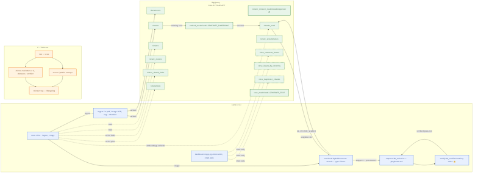
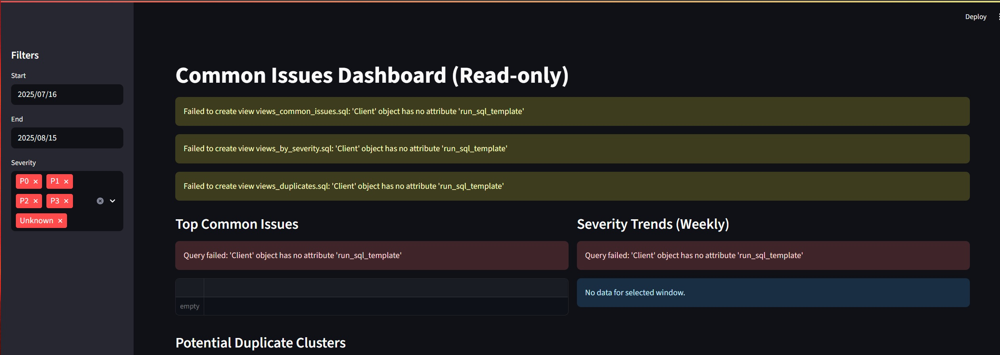

# projectNorthStar

[](https://github.com/rcmiller01/projectNorthStar/actions/workflows/ci.yml)
[](LICENSE)
[](https://www.python.org/)

AI-assisted triage & knowledge retrieval over BigQuery with Vertex AI integration, featuring embeddings, vector search, and a real-time dashboard for issue analysis.

## 🚀 Features

- **BigQuery + Vertex AI Integration**: Remote models for embeddings and text generation
- **Real-time Dashboard**: Streamlit-based analytics dashboard with issue severity tracking
- **Vector Search**: Hybrid retrieval using embeddings and traditional search
- **Issue Triage**: AI-powered automated triage with severity classification
- **Security First**: Proper credential management and data sanitization

## 📋 Prerequisites

- Google Cloud Project with BigQuery and Vertex AI enabled
- Python 3.10+
- Service Account with appropriate permissions:
  - BigQuery Admin
  - Vertex AI User
  - BigQuery Connection Admin

## ⚡ Quick Start

### 1. Environment Setup

Copy the environment template and configure your credentials:

```bash
cp .env.template .env
# Edit .env with your project details and credentials
```

Required environment variables:
```bash
PROJECT_ID=your-project-id
DATASET=demo_ai
LOCATION=US
BIGQUERY_REAL=1
GOOGLE_APPLICATION_CREDENTIALS=/path/to/service-account.json
```

### 2. Installation

Install with all features enabled:
```bash
pip install -e .[bigquery,ingest,dashboard,dev]
```

### 3. BigQuery Setup

Create remote models and views:
```bash
make create-remote-models
make create-views
```

### 4. Data Ingestion

Ingest sample data and generate embeddings:
```bash
python -m core.cli ingest --path samples --type auto --max-tokens 512 --refresh-loop
```

### 5. Launch Dashboard

Start the analytics dashboard:
```bash
streamlit run src/dashboard/app.py
```

Navigate to http://localhost:8501 to view:
- Issue severity distribution
- Common issues breakdown  
- Duplicate content detection
- Interactive filtering and analytics

### 6. AI Triage

Run automated triage analysis:
```bash
python -m core.cli triage --title "500 after reset" --body "android camera" --severity P1 --out out/triage_plan.md
```
	# export BQ_GEN_MODEL=${PROJECT_ID}.${DATASET}.text_model
	```
2. Install (choose extras):
	```bash
	pip install -e .[dev]                 # core + tests
	pip install -e .[bigquery]            # + BigQuery real client
	pip install -e .[bigquery,ingest]     # + OCR / PDF ingest
	```
3. Create remote models (one‑time, idempotent):
	```bash
	make create-remote-models
	export BQ_EMBED_MODEL=${PROJECT_ID}.${DATASET}.embed_model
	export BQ_GEN_MODEL=${PROJECT_ID}.${DATASET}.text_model
	```
4. Ingest sample data (multimodal) + embeddings refresh:
	```bash
	make ingest-samples   # or: python -m core.cli ingest --path samples --type auto --max-tokens 512 --refresh-loop
	```
5. Triage (freeform) OR full demo (also seeds a ticket):
	```bash
	python -m core.cli triage --title "Login 500" --body "after reset" --out out/plan.md
	BIGQUERY_REAL=1 make demo   # requires steps 1-4 & remote models
	```

Optional: run micro eval
```bash
make eval
cat metrics/eval_results.json | jq .aggregate
```

## Build release assets (synthetic)
```bash
make assets
# regenerates docs/dashboard.png, samples_demo_bundle.zip, etc.
```

## External Quickstart (tagged release)

Use this if you just want to try the released package without cloning everything first.

### Install from tag
```bash
pip install "git+https://github.com/rcmiller01/projectNorthStar@v1.0.0"
```

For full features (CLI, dashboard, ingest), clone the repo and install extras:
```bash
git clone https://github.com/rcmiller01/projectNorthStar
cd projectNorthStar
pip install -e .[bigquery,ingest,dashboard,dev]
```

### Configure env
```bash
export PROJECT_ID=<your-gcp-project>
export DATASET=demo_ai
export LOCATION=US
export BIGQUERY_REAL=1   # use real BigQuery client
```
PowerShell uses `$env:VAR="..."` syntax.

### One‑time setup (idempotent)
```bash
make create-remote-models
make create-views
```

### Ingest & triage
```bash
python -m core.cli ingest --path samples --type auto --max-tokens 512 --refresh-loop
python -m core.cli triage --title "login 500 after reset" --body "android camera" --severity P1 --out out/plan.md
```

### Dashboard (read‑only analytics over views)
```bash
pip install -e .[dashboard]
make dashboard
```

### Demo & Eval
```bash
make demo
make eval
```

Safety: surfaced text is truncated (≤200 chars) and obvious secret patterns masked. Use synthetic / non-sensitive data for demos.

---


## Data & Safety
Sample files in `samples/` are synthetic / minimal. No PII shipped. Snippets surfaced are truncated (≤200 chars) and basic masking (emails, bearer tokens, AWS access keys) applies in dashboard & playbooks. Attach only non-sensitive data when experimenting.

## Overview

Core pieces:
- Ingest (logs / pdf / OCR image → chunks → embeddings refresh loop)
- Hybrid retrieval (vector + simple lexical) with multi-type filtering
- Triage orchestrator (retrieve → draft plan → verifier gating)
- Optional ticket schema (writebacks: evidence links + resolutions)
- Streamlit dashboard (common issues, severity trends, duplicates)
- Micro evaluation harness (hit rate / distance / verifier score deltas in CI)
 - Micro evaluation harness (hit rate / distance / verifier score deltas in CI)

### Architecture

Mermaid source: `docs/architecture.mmd`

Generate PNG (requires Mermaid CLI):
```bash
npm i -g @mermaid-js/mermaid-cli
mmdc -i docs/architecture.mmd -o docs/architecture.png -b transparent
```

### Build the diagram
```bash
# Install once
npm i -g @mermaid-js/mermaid-cli
# Generate PNG + SVG
make arch
# Or only one format
make arch-png
make arch-svg
```

### Verify diagram sync
```bash
make arch-verify   # fails if PNG/SVG don't match .mmd
```

**Windows PowerShell alternative:**
```powershell
scripts/arch_verify.ps1   # PowerShell equivalent of make arch-verify
```

Outputs land in `docs/architecture.png` and `docs/architecture.svg`.



Mapping (diagram → code):
- Ingest → `bq/load.py`, `bq/refresh.py`, `sql/upsert_*`, `sql/embeddings_refresh.sql`
- Retrieve → `retrieval/hybrid.py`, `sql/chunk_vector_search.sql`, BigQuery `ML.VECTOR_SEARCH`
- Draft / Verify → `experts/kb_writer.py`, `verify/kb_verifier.py`
- Tickets → `bq/tickets.py`, `sql/ddl_tickets.sql`, `sql/insert_*`
- Dashboard → `src/dashboard/app.py`, `sql/views_*.sql`
- CI / Eval → `.github/workflows/*`, `scripts/run_eval.py`, `scripts/metrics_trend.py`
- Safety → `scripts/secret_sweep.py`, `scripts/public_sweep.py`

## Triage CLI (Phase 1)

Install (core only):
```
pip install -e .
```
Or with BigQuery real client:
```
pip install -e .[bigquery]
```

Run offline (stub client):
```
python -m core.cli triage --title "Login 500" --body "after reset" --severity P2 --out out/plan.md
```

Run with intelligent routing:
```
# Auto mode: learned routing if model exists, else heuristic fallback
python -m core.cli triage --title "PDF export fails" --body "error message" --router auto --out out/plan.md

# Heuristic mode: rule-based routing only
python -m core.cli triage --title "Connection timeout" --body "database error" --router heuristic --out out/plan.md

# Learned mode: BigQuery ML model only (requires training)
python -m core.cli triage --title "Document upload" --body "image processing" --router learned --out out/plan.md
```

Run live (BigQuery):
```
set BIGQUERY_REAL=1               # Windows PowerShell example
set PROJECT_ID=bq_project_northstar
set DATASET=demo_ai
set LOCATION=US
python -m core.cli triage --title "Image upload fails" --body "content-type mismatch" --out out/plan_live.md
```

PowerShell examples:
```
# Offline stub
python -m core.cli triage --title "Login 500" --body "after reset" --out out\smoke.md

# Live BigQuery
$env:BIGQUERY_REAL = "1"
$env:PROJECT_ID = "bq_project_northstar"
$env:DATASET = "demo_ai"
$env:LOCATION = "US"
python -m core.cli triage --title "Image upload fails" --body "content-type mismatch" --out out\smoke_live.md

# Phase-0 validation (requires bigquery extras)
python scripts\validate_phase0.py
```

### Triage Sequence (Ticket Flow)

Mermaid source: `docs/triage_sequence.mmd`

Render to PNG (optional):
```bash
mmdc -i docs/triage_sequence.mmd -o docs/triage_sequence.png -b transparent
```


Key mapping:
- Orchestrator logic: `core/orchestrator.py`
- Ticket repo + schema: `bq/tickets.py`, `sql/ddl_tickets.sql`, `sql/insert_*`
- Retrieval: `retrieval/hybrid.py`, `sql/chunk_vector_search.sql`
- Embedding & search: BigQuery `ML.GENERATE_EMBEDDING`, `ML.VECTOR_SEARCH`
- Draft: `experts/kb_writer.py`
- Verify: `verify/kb_verifier.py`
- Writebacks: `ticket_chunk_links`, `resolutions` tables

### Smart Routing with BigQuery ML

The system includes an intelligent router that adapts retrieval strategy based on query characteristics.

**Router Training:**
```bash
# Train BQML logistic regression model for routing
export PROJECT_ID=bq_project_northstar DATASET=demo_ai BIGQUERY_REAL=1
make train-router

# Or directly
python -m core.cli train-router
```

**Router Modes:**
- `auto` (default): Use learned model if available, fallback to heuristics
- `heuristic`: Rule-based routing using keyword matching
- `learned`: BigQuery ML model only (fails if model missing)

**Routing Strategies:**
- `logs_only`: Types=['log'], k=8 - for error messages, stack traces, timeouts
- `pdf_image`: Types=['pdf','image','image_ocr'], k=6 - for documents, diagrams, manuals
- `mixed`: Types=[], k=10 - for complex queries needing all content types

**Example Usage:**
```bash
# Auto routing (recommended)
python -m core.cli triage --title "Database timeout error" --router auto

# Force heuristic routing
python -m core.cli triage --title "PDF export broken" --router heuristic

# Use learned model (requires training)
python -m core.cli triage --title "Documentation missing" --router learned
```

### Graph-lite Expansion (Optional)

Enhance retrieval quality by expanding vector search results with graph neighbors.

**Build Neighbor Relationships:**
```bash
# Create chunk neighbor table from duplicates and co-links
export PROJECT_ID=bq_project_northstar DATASET=demo_ai
make build-neighbors
```

**Usage:**
```bash
# Enable graph expansion with default boost (0.2)
python -m core.cli triage --title "Database error" --graph-boost 0.2

# Custom boost factor and neighbor limit
python -m core.cli triage --title "Upload failure" --graph-boost 0.3
```

**Scoring Formula:**
- `final_score = (1 - graph_boost) * vector_score + graph_boost * neighbor_weight`
- Default: 80% vector similarity + 20% graph boost
- Safe fallback to vector-only if neighbor table missing

### Enhanced Evaluation Metrics

Comprehensive metrics for retrieval quality assessment and performance monitoring.

**Core Metrics (CI-gated):**
- `hit_rate`: Fraction of queries with at least one matching expected term
- `mean_min_distance`: Average minimum distance across retrieved results
- `mean_verifier_score`: Average verification score for generated playbooks

**Ranking Quality Metrics (Informational):**
- `ndcg@5`: Normalized Discounted Cumulative Gain at rank 5
- `mrr`: Mean Reciprocal Rank of first relevant result
- `semantic_cosine`: Cosine similarity between query and chunk embeddings

**Performance Metrics (Informational):**
- `mean_total_ms/p95_total_ms`: Timing statistics from orchestrator telemetry
- `cost_estimates`: ML API calls and bytes processed tracking

**Usage:**
```bash
# Run evaluation with enhanced metrics
make eval
cat metrics/eval_results.json | jq .aggregate

# CI trend analysis with deltas
python scripts/metrics_trend.py
```

**Metrics Output:**
```json
{
  "aggregate": {
    "hit_rate": 0.85,
    "ndcg@5": 0.721,
    "mrr": 0.650,
    "semantic_cosine": {"mean": 0.823, "p25": 0.701, "p50": 0.834, "p75": 0.901},
    "timings": {"mean_total_ms": 45.2, "p95_total_ms": 89.1},
    "cost_estimates": {"total_ml_calls": 125, "avg_ml_calls_per_query": 6.25}
  }
}
```

### Create Remote Models (Embedding + Text)

You can create the two required remote Vertex models inside your dataset via BigQuery ML.

Bash:
```
export PROJECT_ID=bq_project_northstar
export DATASET=demo_ai
export LOCATION=US            # BigQuery dataset location
export VERTEX_REGION=us-central1
# optional overrides
# export EMBED_ENDPOINT=text-embedding-004
# export TEXT_ENDPOINT=gemini-1.5-pro
make create-remote-models
```

PowerShell:
```
$env:PROJECT_ID    = "bq_project_northstar"
$env:DATASET       = "demo_ai"
$env:LOCATION      = "US"            # BigQuery dataset location
$env:VERTEX_REGION = "us-central1"
$env:EMBED_ENDPOINT = "text-embedding-004"
$env:TEXT_ENDPOINT  = "gemini-1.5-pro"

bq query --location=$env:LOCATION --use_legacy_sql=false `
	--parameter=embed_model_fqid:STRING:"$($env:PROJECT_ID).$($env:DATASET).embed_model" `
	--parameter=embed_endpoint:STRING:"$env:EMBED_ENDPOINT" `
	--parameter=text_model_fqid:STRING:"$($env:PROJECT_ID).$($env:DATASET).text_model" `
	--parameter=text_endpoint:STRING:"$env:TEXT_ENDPOINT" `
	--parameter=region:STRING:"$env:VERTEX_REGION" `
	< sql\create_remote_models.sql
```

Idempotent: Re-running `make create-remote-models` will skip any model that
already exists and only create missing ones.

After creation set (FQIDs):
```
export BQ_EMBED_MODEL=${PROJECT_ID}.${DATASET}.embed_model
export BQ_GEN_MODEL=${PROJECT_ID}.${DATASET}.text_model
```
or in PowerShell:
```
$env:BQ_EMBED_MODEL = "$env:PROJECT_ID.$env:DATASET.embed_model"
$env:BQ_GEN_MODEL   = "$env:PROJECT_ID.$env:DATASET.text_model"
```

### Teardown Remote Models

When finished (to avoid lingering remote model objects) you can drop them. This is idempotent.

Bash:
```
export PROJECT_ID=bq_project_northstar
export DATASET=demo_ai
export LOCATION=US
make destroy-remote-models
```

PowerShell (Make target also works if make is installed, otherwise run manually):
```
$env:PROJECT_ID = "bq_project_northstar"
$env:DATASET    = "demo_ai"
$env:LOCATION   = "US"
powershell -NoProfile -Command "bq query --use_legacy_sql=false \"$([IO.File]::ReadAllText('sql/drop_remote_models.sql'))\""
```

Or manually specifying FQIDs (bash):
```
export BQ_EMBED_MODEL=${PROJECT_ID}.${DATASET}.embed_model
export BQ_GEN_MODEL=${PROJECT_ID}.${DATASET}.text_model
bq query --use_legacy_sql=false "$(cat sql/drop_remote_models.sql)"
```

### Preflight (models only)

Fast check that the two remote models exist (skips dataset / table checks):

Bash:
```
export PROJECT_ID=bq_project_northstar
export DATASET=demo_ai
export LOCATION=US
export BQ_EMBED_MODEL=${PROJECT_ID}.${DATASET}.embed_model
export BQ_GEN_MODEL=${PROJECT_ID}.${DATASET}.text_model
make preflight-models
```

PowerShell:
```
$env:PROJECT_ID = "bq_project_northstar"
$env:DATASET    = "demo_ai"
$env:LOCATION   = "US"
$env:BQ_EMBED_MODEL = "$env:PROJECT_ID.$env:DATASET.embed_model"
$env:BQ_GEN_MODEL   = "$env:PROJECT_ID.$env:DATASET.text_model"
python scripts\check_bq_resources.py --models-only
```

### Safe Teardown

Refuses to drop without an explicit FORCE=1 confirmation.

Bash:
```
FORCE=1 make destroy-remote-models
```

PowerShell:
```
$env:FORCE = "1"; make destroy-remote-models
```

## Next Steps
- Add project source code
- Configure tooling (linting, tests, CI)
- Document setup and usage

## Dashboard (read-only)

Lightweight analytics (Phase 5) built with Streamlit over BigQuery views.

Install (add streamlit):
```
pip install -e .[bigquery]
pip install streamlit -q
```

Extras examples:
```
# minimal dev
pip install -e .[dev]
# run dashboard
pip install -e .[dashboard]
# all-in
pip install -e .[bigquery,ingest,dashboard,dev]
```

Run (PowerShell example):
```
set BIGQUERY_REAL=1
set PROJECT_ID=bq_project_northstar
set DATASET=demo_ai
set LOCATION=US
make dashboard
```

Or offline stub (empty data but UI renders):
```
make dashboard
```

Views created (idempotent) inside your dataset:
- view_common_issues: naive fingerprint aggregation (first 8 normalized words)
- view_issues_by_severity: weekly counts by normalized severity (P0–P3, Unknown)
- view_duplicate_chunks: approximate duplicate clusters via ML.VECTOR_SEARCH

UI sections (row caps applied):
- Top common issues (snippet ≤200 chars, counts, last seen)
- Severity trends (weekly area chart)
- Potential duplicate clusters (expanders with sample members)

Placeholder screenshot (replace `docs/dashboard.png` once captured):
```

```

PII safety: snippets truncated to 200 chars + basic masking (emails, bearer tokens, AWS access keys). No writes or full meta exposure.

## Quick Demo (end-to-end)

Requires live BigQuery (BIGQUERY_REAL=1) and existing remote models.

```bash
export PROJECT_ID=bq_project_northstar
export DATASET=demo_ai
export LOCATION=US
export BIGQUERY_REAL=1
pip install -e .[bigquery,ingest,dashboard,dev]
make demo
```

Output artifacts:
- `out/demo_freeform.md` freeform triage playbook
- `out/demo_ticket.md` ticket triage playbook (DEMO-1)

Summary line example:
```
[demo-summary] ticket_links=5 resolutions=1 k=5
```

Flags: `--no-refresh-loop`, `--max-comments N`, `--k K` (pass via `python scripts/demo_end_to_end.py ...`).

## Micro Eval

Generates a deterministic synthetic eval set (20 items) and runs comprehensive retrieval metrics.

Stub (offline) or real depending on BIGQUERY_REAL (force stub with `--use-stub`).

```bash
make eval
cat metrics/eval_results.json | jq .aggregate
```

Files produced:
- `metrics/eval_set.jsonl` (input set)
- `metrics/eval_results.json` (per-item + aggregate metrics)

### Metrics Definitions

Core metrics (used for CI gating):
- `hit_rate`: fraction of queries with at least one relevant chunk (substring match)
- `mean_min_distance`: average minimum vector distance across queries
- `mean_verifier_score`: average playbook verification success (may be null if skipped)
- `ndcg_at_k`: normalized Discounted Cumulative Gain at k (ranking quality)
- `mrr`: Mean Reciprocal Rank of first relevant result

Extended metrics (informational):
- `semantic_cosine`: cosine similarity between query and chunk embeddings (p25/p50/p75/mean)
- `timings`: step timing breakdowns in milliseconds (mean/p95)
- `cost_estimates`: ML API calls and bytes processed per query

All metrics are available in `metrics/eval_results.json` under the `aggregate` key.

## Submission Notebook

Notebook: `notebooks/Submission_Demo.ipynb`

Run cells top-to-bottom after setting env vars. Safe to re-run; creates views, ingests samples, performs freeform & (optional) ticket triage and displays outputs. For dashboards, run `make dashboard` locally outside hosted notebook environments.

Kaggle note: if editable installs are restricted, replace `pip install -e .[extras]` with `pip install .[extras]`.

## Tickets (optional, generic schema)

### What this adds

Triage by `--ticket-id` using BigQuery tables (`tickets`, `ticket_events`,
`ticket_attachments`) plus retrieval to produce a verified playbook. Evidence
links are written to `ticket_chunk_links`; the generated plan snapshot goes to
`resolutions`. Multimodal attachments (pdf/image/log) flow through Phase-3
ingest and become searchable chunks.

### Install
```bash
pip install -e .[bigquery]            # core
# or, if you plan to ingest attachments locally:
pip install -e .[bigquery,ingest]
```
Create the schema (idempotent):
```bash
python -c "from bq.tickets import TicketsRepo; from bq.bigquery_client import RealClient; TicketsRepo(RealClient()).ensure_schema()"
```
Seed a demo ticket (optional): `make demo` seeds `DEMO-1` or see
`scripts/demo_end_to_end.py` for inline MERGE example.

### Triage a ticket
```bash
# Writebacks enabled (default)
python -m core.cli triage --ticket-id DEMO-1 --severity P1 --out out/DEMO-1.md

# Read-only (no writebacks)
python -m core.cli triage --ticket-id DEMO-1 --no-write --severity P1 --out out/DEMO-1.md

# Control comments considered from ticket history (default: 5)
python -m core.cli triage --ticket-id DEMO-1 --max-comments 3 --out out/DEMO-1.md
```

### What gets written

`ticket_chunk_links`: rows `{ticket_id, chunk_id, relation="evidence", score≈(1-distance)}`

`resolutions`: `{ticket_id, resolved_at, resolution_text, playbook_md}`

### Dashboard integration

As you ingest / triage, related chunks impact:
- Common issues (fingerprint frequency)
- Severity trends (weekly buckets)
- Duplicate clusters (approx neighbor groups)

Provenance in playbooks & dashboard renders as `(log:file:line)` or
`(pdf:name:p#)`.

### Safety & PII

Surfaced text is truncated (≤200 chars) and emails / bearer tokens / AKIA keys
masked in UI. Keep attachments non-PII in demos; prefer synthetic samples. Use
`--no-write` when exploring.

## CI Eval Metrics

CI archives eval metrics and shows trend deltas on each PR. Threshold env vars:
`MIN_HIT_RATE`, `MAX_MIN_DIST`, `MIN_VERIFIER` guard regressions. See
`scripts/metrics_trend.py` and the `eval-ci` Make target.

## License

Project is released under the MIT License. See `LICENSE`.

## Public Datasets

Sample paths and BigQuery public data used for demonstration (e.g., cloud-samples-data and BigQuery Public Datasets) are for evaluation only. Remove or replace with your own data in production.

## License

Released under the MIT License (see `LICENSE`). Sample data is synthetic. If you add third-party datasets or models, ensure their licenses are compatible and document them here.

## Dev setup (format+lint hooks)
```
pip install -e .[dev]
make setup-dev

# run checks locally
make check
# or enforce pre-commit on all files
make pre-commit-all
```

## Create dashboard views (idempotent)
```
export PROJECT_ID=bq_project_northstar
export DATASET=demo_ai
export LOCATION=US
pip install -e .[bigquery]
make create-views

# Then run the dashboard:
pip install -e .[dashboard]
make dashboard
```


## Multimodal Ingest (Phase 3)

Install ingest extras (OCR + image support):
```
pip install -e .[ingest]
```
Or with BigQuery live features:
```
pip install -e .[bigquery,ingest]
```

Ingest sample folder (stub / offline):
```
python -m core.cli ingest --path samples --type auto --max-tokens 512 --refresh-loop
```

Make target wrapper:
```
make ingest-samples
```

Live BigQuery embedding refresh (example PowerShell):
```
$env:BIGQUERY_REAL = "1"
$env:PROJECT_ID = "bq_project_northstar"
$env:DATASET = "demo_ai"
$env:LOCATION = "US"
$env:BQ_EMBED_MODEL = "$env:PROJECT_ID.$env:DATASET.embed_model"
python -m core.cli ingest --path samples --type auto --max-tokens 512 --refresh-loop
```

Output prints counts: Docs, Chunks, NewEmbeddings (0 offline).

Token / batch controls:
- Chunk size: --max-tokens (capped internally at 4096)
- Embedding batch limit: EMBED_BATCH_LIMIT env (default 10000, <=50000)

Provenance formats rendered in References section:
```
log  -> bq.vector_search:log:{basename}:{line_no}
pdf  -> bq.vector_search:pdf:{basename}:p{page}
image_ocr -> bq.vector_search:image_ocr:{basename}:p{page}
image -> bq.vector_search:image:{basename}
```

### Severity Flag

You can annotate a ticket with an explicit severity (case-insensitive):

PowerShell:
```
python -m core.cli triage --title "Intermittent 500" --body "after reset" --severity p1 --out out\p1.md
```

Bash:
```
python -m core.cli triage --title "Intermittent 500" --body "after reset" --severity P1 --out out/p1.md
```

Accepted values: P0, P1, P2, P3, High, Medium, Low, Unknown.

### Multi-type Vector Filtering

`chunk_vector_search` automatically supports filtering by multiple types (e.g. logs + pdf). Pass a list of types in code, or ingest mixed sources: the SQL uses an array literal and filters server-side.

Example (Python):
```
from src.retrieval.hybrid import chunk_vector_search
rows = chunk_vector_search(client, query_text="login failure", types=["log","pdf"])
```

### Full Embedding Refresh (Looped Batching)

The refresh can now loop batches until no new rows are inserted.

One-off (PowerShell):
```
python -c "from bq.refresh import refresh_embeddings; from bq import make_client; print(refresh_embeddings(make_client(), loop=True))"
```

Or use the helper script / make target:
```
make refresh-all
```

Environment variable `EMBED_BATCH_LIMIT` controls per-batch size (default 10000, max 50000).

---
Generated initial commit scaffold.

## Release Process

Automated helper scripts + Make targets streamline versioned releases (SemVer).

Dry run (compute next version only):
```
make release-dry-run part=patch
```

Full release (updates version, changelog, commit + tag):
```
make release part=minor
```

Workflow:
1. Clean working tree enforced
2. Determine new version from `part=` (major|minor|patch)
3. Generate grouped changelog from commits since last tag
4. Update `pyproject.toml` + prepend `CHANGELOG.md`
5. Commit `chore(release): vX.Y.Z` and create git tag `vX.Y.Z`

Push after review:
```
git push origin main --tags
```

## Secret & Public Sweeps

Secret scan (regex + entropy) locally:
```
make sweep-secrets
```
Strict mode:
```
make sweep-secrets-strict
```
Allowlist file: `secrets_allowlist.txt` (exact matches only).

Public artifact sweep (large files, notebook outputs, internal URLs, cred file patterns):
```
make public-sweep
```

Both run in CI (see `secret_scan.yml` + `public_sweep` job in `ci.yml`). Findings summarized in PR checks.

Pre-commit hooks: `secret-sweep` (medium threshold) and `nbstripout` (removes notebook outputs on commit).

## Maintenance Checklist (Before Release)
1. `make check` passes
2. `make sweep-secrets` clean (or intentional allowlist rationale documented)
3. `make public-sweep` clean
4. CI eval metrics within thresholds
5. Docs updated for new flags/models
6. `make release-dry-run part=patch` sanity check
7. `make release part=patch` then push tag
